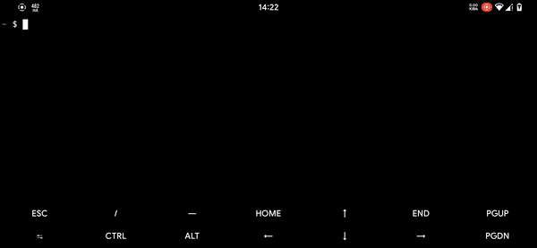

# Charge Control Magisk Module

## Description

This Magisk module provides control over the charging current on Magisk-rooted Android devices. It allows users to customize and manage the charging current settings for different power supply sources.

## Features

Flexible Charging Current Management: Adjust the charging current for various power supply sources such as USB, battery, and more.
Default and Custom Settings: Choose between default charging settings or set a custom charging current based on your preferences.
No need to reboot for changes to take effect.

## Usage

  
  
- Flash the module in Magisk Manager.
- Adjust Charging Current:
  - Open a terminal emulator (Termux recommended).
  - Type `su -c charge` to access the charging control options.
  - Choose between default or custom charging current settings.
  - For custom settings, input the desired charging current in milliamps (mA).

## License

This module is released under the GNU General Public License v3 (GPL-3). All module code is open source.

Disclaimer: Charging settings customization may affect device performance. Use with caution.

